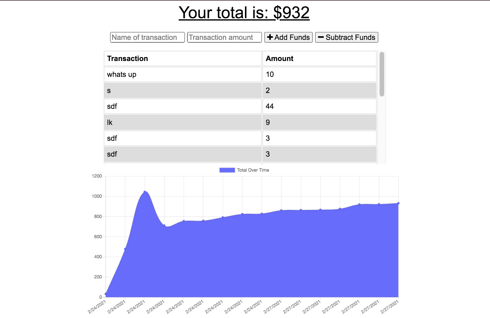

# Budget Tracker
Progressive web app budget tracker. Any changes that a user makes offline will be added to the total when the app comes back online.
Web app can also be downloaded and used as a desktop app.

## Deployed app
[Budget Tracker](https://github.com/lnewmanheggie/budget-tracker)

## Technologies used
<li> MongoDB
<li> IndexedDB
<li> Node.js
<li> Express.js